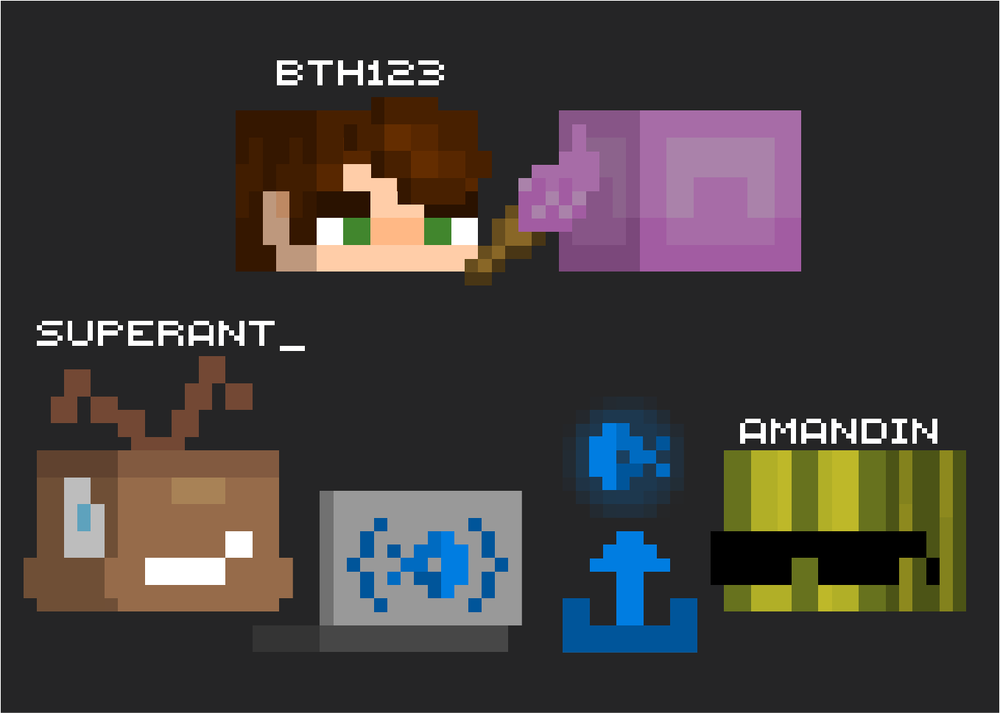

# Datapack Icons 2.0 - Resourcepack Update!

---
Datapack Icons is a minimialistic, minecraft-styled icon theme, designed specifically for datapack & resourcepack devs. Looking through [Microsoft behavior packs documentation](https://learn.microsoft.com/en-us/minecraft/creator/documents/behaviorpack#building-the-behavior-pack), we took inspiration from those icons, and decided to implement them in VS Code. 

## Icons

## Why did we choose *this* icon for *that*?
### Datapacks
- Chest can contain things, such as `folder`
- Shulker represents that `data`pack can be carried between the worlds
- Advancement icon for `advancements`
- **Chat** bubble for `chat_type`
- Sword can deal damage that is associated with red color, that's why it's for `damage_type`
- You can go in the nether portal to go to the other `dimension`
- End portal and nether portal lead to different dimensions, so they represent `dimension_type`
- `functions` contain commands, such as command blocks
- An iconic item, such as a diamond pickaxe, can represent `item_modifiers`
- You can get some valuable **loot** from `loot_tables`, such as an emerald
- Observer checks things, `predicates` also can check for something
- We use `recipes` in the crafting table
- Name **tag** can represent `tags`
- diamond armor with a redstone trim is for `trim_material`
- diamond armor with a neutral color trim is for `trim_pattern`
- When we think of a minecraft world, we usually think of lots of grass blocks, so it represents `worldgen`
- `tick functions` run every tick, as well as repeating command blocks
- Next to repeating command blocks, we usually put chain command blocks, such as `normal functions` that are usually run by tick functions
- Impulse command block runs the command only one time after we activate it, like a `load function`, which we activate with /reload
- **Structure** block represents `structure files`
- We write something on paper scrolls, as well as in `most of the file formats`
- Curly brackets are basically essential in `.json` files
- Lines of text represent `.txt`
- `Markdown` files usually contain some information, and letter **i** usually represents info
- `pack.mcmeta` is used like a document for datapacks and resourcepacks to be used by minecraft, so it has shulker icon on it
- Key, that can lock something valuable, represents `LICENSE` files
- Copyright sign (©) for `COPYRIGHT` files
- Painting contains an image, as well as `.png` and other image file formats
- `beet` and `bolt` are pretty self-explanatory :​)
- Ender chest is like a space storage, so it can represent the `namespace`, but unfortunately there is no feature in icon themes that can change icons for any folder within data folder yet, so this icon is unused
### Resourcepacks
- Cyan shulker represents `assets` the same way as the `data` icon, the color is cyan because of [this](https://learn.microsoft.com/en-us/minecraft/creator/documents/resourcepack#building-the-resource-pack)
- `atlases` are associated with maps that are associated with compasses
- Waterlogged fence shows a lot of `blockstates`
- Letter **F** for `font`
- Planet can represent lots of `lang`uages
- Blockbench default cube is a start of `models`
- Happy villager particle for `particles`
- RGB triangle is often a beginner task for `shaders`, `.glsl` devs
- Note block makes `sounds` that in resourcepacks and other places can be `.ogg` or `.mp3` files
- There are some `texts` on the paper!
- Brushes draw the `textures`
- Note on a paper represents `sounds.json` as some sort of sound configuration file
- Highlighted vertices on a triangle represent `Vertex SHader` files
- RGB pixel represents `Fragment SHader` files
---
## Creators
SuperAnt_ (`super.ant_` on discord) - Came up with the initial idea, made the extension

bth123 - Made all the icons and illustrations

amandin - Our PR-manager, gave ideas for icons, included this extension in his [amazing extension collection](https://marketplace.visualstudio.com/items?itemName=amandin.dpc-pack), and made us a [promotion video](https://www.youtube.com/watch?v=my2vfqsRKgE) 

**Enjoy!**
