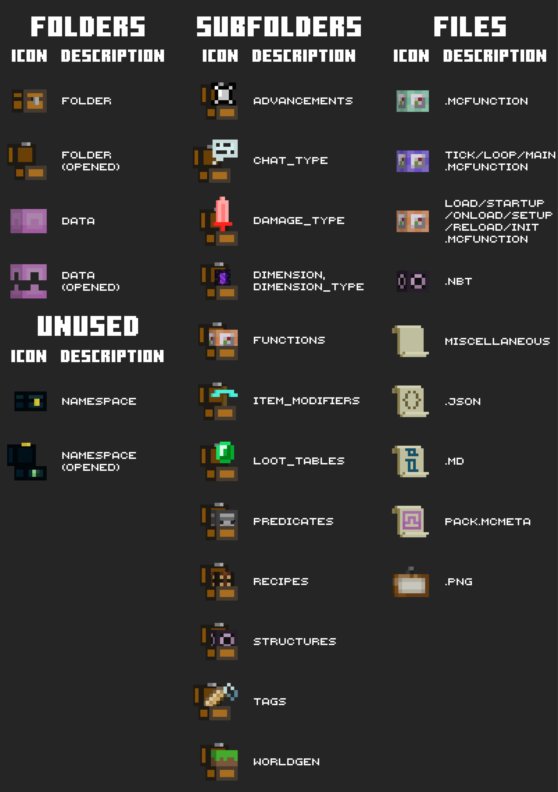

# Datapack Icons -

is a minimialistic, minecraft-styled icon theme, designed specifically for datapack devs. Looking through [Microsoft behavior packs documentation](https://learn.microsoft.com/en-us/minecraft/creator/documents/behaviorpack#building-the-behavior-pack), we took inspiration from those icons, and decided to implement them in VS Code. 

## Icons

## Why did we choose *this* icon for *that*?

- Chest can contain things, such as `folder`
- Shulker represents that `data`pack can be carried between the worlds
- Advancement icon for `advancements`
- **Chat** bubble for `chat_type`
- Sword can deal damage that is associated with red color, that's why it's for `damage_type`
- You can go in the nether portal to go to the other `dimension` or `dimension_type`
- `functions` contain commands, such as command block
- An iconic item, such as diamond pickaxe, can represent `item_modifiers`
- You can get some valuable **loot** from `loot_tables`, such as emerald
- Observer checks things, `predicates` also can check for something
- We use `recipes` in the crafting table
- Name **tag** can represent `tags`
- When we think of a minecraft world, we usually think of lots of grass blocks, so it represents `worldgen`
- `tick functions` run every tick, as well as repeating command block
- Next to repeating command blocks, we usually put chain command blocks, such as `normal functions` are usually run by tick functions
- Impulse command block runs the command only one time after we activate it, like a `load function` which we activate with /reload
- **Structure** block represents `structure files`
- We write something on paper scrolls, as well as in `most of the file formats`
- Curly brackets are basically essential in `.json` files
- `Markdown` files usually contain some information, and letter **i** usually represents info
- `pack.mcmeta` is used like a document for datapacks to be used by minecraft, so it has shulker icon on it
- Painting contains an image, as well as `.png` files

- Ender chest is like a space storage, so it can represent the `namespace`, but unfortunately there is no feature in icon themes that can change icons for any folder within data folder yet, so this icon is unused
---
## Creators
SuperAnt_#7967 - Made the extension, gave ideas for icons

bth123#0123 - Made all the icons and illustrations

amandin#5551 - Helped with publishing the extension, gave ideas for icons, also included this extension in his [amazing extension collection](https://marketplace.visualstudio.com/items?itemName=amandin.dpc-pack)

**Enjoy!**
